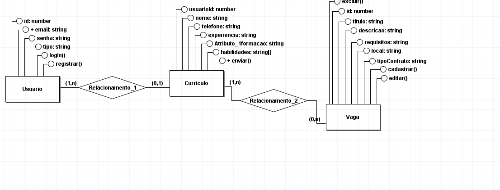

# Portal_Rh2.0

# 📄 Plataforma RH – Cadastro de Vagas e Currículos com Acesso Autenticado

**Data de atualização:** 12/08/2025

---

## 📌 Informações Gerais
- **Cliente:** RH Connect  
- **Equipe de Desenvolvimento:**
  - Daniel (PO – Product Owner)
  - Gullit
  - Esther
  - Laiza
- **Tecnologias Principais:** Angular 16+, SCSS, JSON Server  
- **Público-Alvo:**
  - **Usuário Comum:** Candidatos que realizam cadastro e enviam currículos.
  - **Administrador:** Responsável pela gestão das vagas e visualização dos currículos recebidos.

---

## 🎯 Objetivo Geral
Desenvolver uma aplicação Angular com back-end simulado (JSON Server) que permita a gestão de vagas e currículos, com autenticação (login/registro) e autorização por tipo de usuário (Admin e Usuário Comum).

---

## 🛠 Objetivos Específicos
- Compreender a diferença entre autenticação e autorização.  
- Implementar guardas de rota para perfis de usuário.  
- Criar formulários reativos com validação no Angular.  
- Simular um back-end com JSON Server.  
- Desenvolver componentes reutilizáveis com código organizado.  
- Aplicar SCSS customizado para layout moderno e responsivo.  
- Produzir uma SPA funcional baseada em briefing realista.  

---

## 📅 Andamento do Projeto
**Concluído até 12/08/2025:**
- Levantamento de requisitos
- Protótipo de telas no **Figma**
- Diagrama de classes UML
- Definição da estrutura de dados (`db.json`)

**Próximas Etapas:**
- **19/08/2025 (terça-feira):** Início da codificação no Angular  
- **19/08/2025:** Entrega do vídeo demonstrativo do site  

---

## 📋 Escopo Funcional

### Usuário Comum
- Cadastro de conta  
- Login  
- Envio de currículo  
- Visualização de vagas  

### Administrador
- Login  
- Cadastro, edição e exclusão de vagas  
- Visualização de currículos recebidos  

---

## 🗄 Estrutura de Dados (JSON Server)
```json
{
  "usuarios": [
    {
      "id": 1,
      "email": "admin@rh.com",
      "senha": "admin123",
      "tipo": "admin"
    }
  ],
  "curriculos": [],
  "vagas": []
}

## Diagrama de Classes


